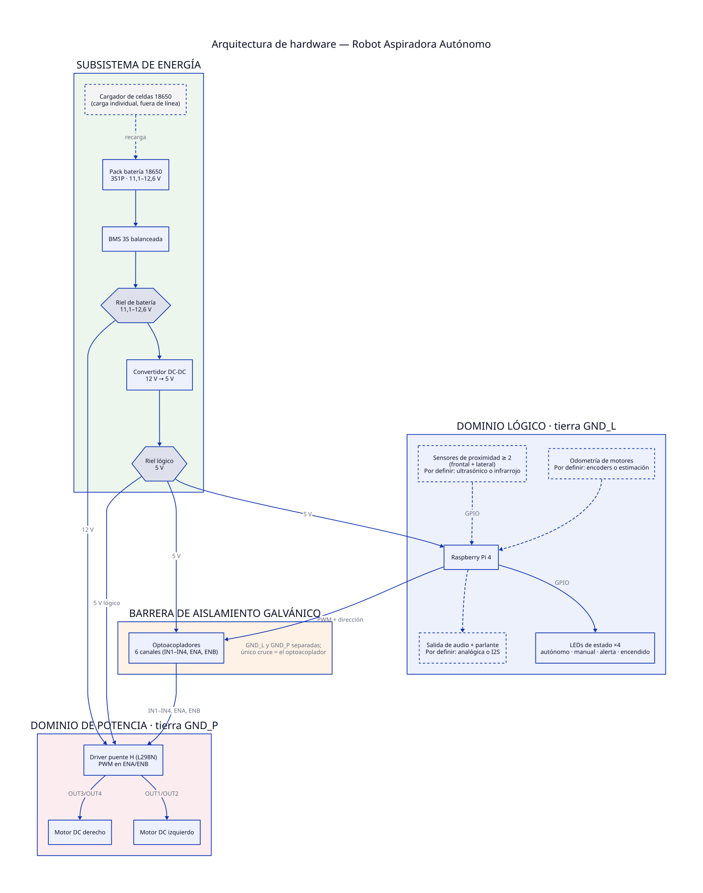

# 🤖 Roomba-Disco (Raspberry Pi 4)

Este repositorio contiene la infraestructura de **Linux Embebido**, la cadena de compilación cruzada (**SDK/Toolchain**) y el software de abstracción de hardware desarrollados para el robot aspiradora **Roomba-Disco**. El proyecto se basa en la distribución **Poky (Release 5.0 Scarthgap)** del **Proyecto Yocto** para la arquitectura **Raspberry Pi 4**.

---

## 💻 1. Diagramas de Arquitectura del Sistema

### 🏛️ Arquitectura de Software (Capas del Sistema)
El sistema está estructurado bajo un modelo en 4 niveles:

```text
+-----------------------------------------------------------------------+

|  CAPA 1: CLIENTE WEB / FRONTEND (Interfaz de Usuario)                 |
|  - Panel de control, Joystick virtual, Monitoreo de sensores 2D.     |
+-----------------------------------------------------------------------+
                                   │  (WebSockets / HTTP)
                                   ▼
+-----------------------------------------------------------------------+

|  CAPA 2: SERVIDOR WEB & LÓGICA (Backend en Node.js / Python / C++)    |
|  - Endpoints de control, algoritmo reactivo de evasión y mapeo.       |
+-----------------------------------------------------------------------+
                                   │  (Enlace Dinámico en C)
                                   ▼
+-----------------------------------------------------------------------+

|  CAPA 3: BIBLIOTECA DE ABSTRACCIÓN DE HARDWARE (libthgpio.so)         |
|  - Funciones nativas de control y hilos concurrentes de audio (POSIX).|
+-----------------------------------------------------------------------+
                                   │  (Llamadas al Sistema /sysfs)
                                   ▼
+-----------------------------------------------------------------------+

|  CAPA 4: INFRAESTRUCTURA / KERNEL LINUX EMBEBIDO (Yocto RootFS)       |
|  - Controladores PWM, ALSA Core, mpg123, Demon Systemd.            |
+-----------------------------------------------------------------------+
```

### 📟 Arquitectura de Hardware



> Fuente del diagrama: [`diagramas/arquitectura-hardware.d2`](diagramas/arquitectura-hardware.d2)
> ([D2](https://d2lang.com/)). Regenerar con:
> `d2 diagramas/arquitectura-hardware.d2 diagramas/arquitectura-hardware.svg`.

El sistema se divide en cuatro dominios:

- **Subsistema de energía.** Pack de baterías 18650 en 3S1P (11,1–12,6 V) con BMS 3S
  balanceada. De ahí salen dos rieles regulados por separado: el riel de batería
  (11,1–12,6 V) alimenta la etapa de potencia y un convertidor DC-DC deriva el riel
  lógico de 5 V. Las celdas se cargan de forma individual, fuera de línea.
- **Dominio lógico** (tierra `GND_L`). Raspberry Pi 4 con imagen mínima construida con
  Yocto; expone el acceso a hardware mediante la biblioteca de control. Cuelgan de ella
  los sensores de proximidad (≥ 2, frontal y lateral), los 4 LEDs de estado, la salida
  de audio y la odometría de los motores.
- **Barrera de aislamiento galvánico.** Optoacopladores en las 6 líneas de control del
  driver (`IN1`–`IN4`, `ENA`, `ENB`). Las tierras `GND_L` y `GND_P` se mantienen
  separadas y su único punto de cruce es el optoacoplador.
- **Dominio de potencia** (tierra `GND_P`). Driver de puente H (L298N) con control de
  velocidad por PWM en `ENA`/`ENB`, y los dos motores DC de la tracción diferencial.

#### Mapa de pines GPIO (Raspberry Pi 4)
El PWM de los motores se asignó a `GPIO12`/`GPIO13` (PWM0) en vez de `GPIO18`/`GPIO19`
(PWM1) para dejar esas líneas libres, por si la salida de audio termina siendo un DAC
por I2S en lugar de jack analógico.

| Función | Pin BCM | Pin físico | Dirección | Periférico | Nota |
|---|---|---|---|---|---|
| ENA (vel. motor izq.) | GPIO12 | 32 | out | PWM0 (hw) | por optoacoplador |
| ENB (vel. motor der.) | GPIO13 | 33 | out | PWM0 (hw) | por optoacoplador |
| IN1 (dir. motor izq. A) | GPIO5 | 29 | out | GPIO | por optoacoplador |
| IN2 (dir. motor izq. B) | GPIO6 | 31 | out | GPIO | por optoacoplador |
| IN3 (dir. motor der. A) | GPIO16 | 36 | out | GPIO | por optoacoplador |
| IN4 (dir. motor der. B) | GPIO17 | 11 | out | GPIO | por optoacoplador |
| LED autónomo | GPIO22 | 15 | out | GPIO | directo (con resistencia) |
| LED manual | GPIO23 | 16 | out | GPIO | directo |
| LED alerta obstáculo | GPIO24 | 18 | out | GPIO | directo |
| LED encendido | GPIO25 | 22 | out | GPIO | directo |
| Sensores (frontal/lateral) | por definir | — | in | GPIO / I2C | depende de la tecnología de sensor elegida |
| Audio | por definir | 18-21 reservados | — | I2S / jack | el jack analógico no usa pines del header |

`GPIO2`/`GPIO3` (I2C), `GPIO14`/`GPIO15` (UART) y `GPIO7`-`GPIO11` (SPI) se dejan libres
por si algún sensor o la consola de depuración los necesitan.

La salida del optoacoplador es open-collector e invierte la señal recibida; la
compensación se hace en la biblioteca de control, no en la asignación de pines.

#### Decisiones de hardware pendientes

Las cajas y flechas punteadas del diagrama marcan puntos aún sin cerrar:

| Elemento | Pendiente |
|---|---|
| Sensores de proximidad | Tecnología: ultrasónico (HC-SR04) o infrarrojo |
| Salida de audio | Ruta: analógica (jack + amplificador) o DAC I2S |
| Odometría | Método: encoders en las ruedas o estimación por tiempo/PWM |

---

## 🛠️ 2. Instrucciones de Generación de la Imagen Yocto

**Aviso**: En los ejemplos de código habrán direcciones que tienen dirección parecida a `home/irmunoz/Taller4/`, ajustar a su usuario o directorio donde van a trabajarlo.

### Requisitos del Host (Anfitrión)
* **SO Recomendado:** Ubuntu 22.04 LTS o 24.04 LTS.
* **Espacio Libre:** Mínimo 90 GB en disco duro.
* **Paquetes Esenciales:** `gawk`, `wget`, `git`, `diffstat`, `unzip`, `texinfo`, `gcc`, `build-essential`, `chrpath`, `socat`, `cpio`, `xz-utils`, `zstd`, `liblz4-tool`, `file`.

### Paso 1: Clonar el Entorno Base y la Capa BSP
```bash
# Clonar Poky (Distribución base de Yocto - Versión Scarthgap)
git clone --branch yocto-5.0.15 https://yoctoproject.org poky-scarthgap-5.0.15
cd poky-scarthgap-5.0.15

# Clonar el BSP Oficial de Raspberry Pi
git clone --branch scarthgap https://github.com/raspberrypi/linux
```
Si hubo algún problema a la hora de clonar el BSP Oficial, se puede descargar y continuar luego localmente guardando en un directorio creado para descargas

```bash
mkdir downloads
```

 y colocas el archivo descargado desde: `https://github.com/raspberrypi/linux/archive/refs/heads/rpi-6.6.y.tar.gz` y lo descomprimes en una carpeta que vamos a llamar `k-robot`y movemos la subcarpeta.

```bash
mkdir -p ~/k-robot
tar -xf linux-rpi-6.6.y.tar.gz -C ~/k-robot --strip-components=1
mv linux-rpi-6.6.y/* . 2>/dev/null || mv linux-rpi-*/* . 2>/dev/null
```

### Paso 2: Creación e Integración de layer personalizada `meta-robot`
Para alojar nuestras recetas, configuraciones multimedia y parches offline, se inicializa el entorno y se genera la capa del proyecto:
```bash
# Inicializar variables de entorno de BitBake
source oe-init-build-env rpi4

# Crear la capa meta-robot
bitbake-layers create-layer ../meta-robot

# Registrar y habilitar formalmente la capa en el entorno actual
bitbake-layers add-layer ../meta-robot
```

### Paso 3: Agregar el parche para búsqueda del BSP offline

En el directorio de construcción activa: `~/Taller4/poky-scarthgap-5.0.15/rpi4` creamos el parche:
```bash
nano ../meta-robot/recipes-kernel/linux/linux-raspberrypi_6.6.bbappend
```
Agregamos estas líneas al archivo usando la dirección de la carpeta k-robot:
```bash
inherit externalsrc
EXTERNALSRC = "/home/irmunoz/k-robot"

# Forzar el bypass definitivo de parches y chequeos de internet
KERNEL_DANGLING_FEATURES_WARN_ONLY = "1"
KERNEL_VERSION_SANITY_SKIP = "1"
```

### Paso 4: Configuración del Sistema (`conf/local.conf`)


Edite el archivo `conf/local.conf` para definir la máquina objetivo, habilitar la compilación offline (mitigación del error de red 128) y activar los módulos de hardware requeridos (Audio y PWM):
```bash
nano conf/local.conf
```
Agregar al final del archivo local.conf para el sistema:
```text
# [ESPECIFICA EL HARDWARE OBJETIVO]
MACHINE ?= "raspberrypi4"
CONF_VERSION = "2"

# [OPTIMIZACIÓN DE RECURSOS DEL HOST]
# Limita la ejecución a 5 hilos de procesamiento en paralelo para la estabilidad de la VM
BB_NUMBER_THREADS = "5"
PARALLEL_MAKE = "-j 5"
INHERIT += "rm_work"
SANITY_TESTED_DISTROS:append = " Ubuntu-24.04"

# [GESTIÓN DE ALMACENAMIENTO Y DESCARGAS OFFLINE]
DL_DIR ?= "/home/irmunoz/Taller4/poky-scarthgap-5.0.15/downloads"
PREMIRRORS:prepend = "git://./. https://yoctoproject.org \n"
BB_FETCH_PREFERENCE = "https http git"
BB_GIT_SHALLOW = "1"
BB_NO_NETWORK = "0"
BB_GENERATE_MIRROR_TARBALLS = "1"

# [MITIGACIÓN DE DESARROLLO LOCAL] Parche de bypass para desarrollo local offline del Kernel y biblioteca
INHERIT += "externalsrc"
KERNEL_VERSION_SANITY_SKIP = "1"

# [POLÍTICA DE LICENCIAS] Permite compilar componentes con restricciones de patentes y firmware propietario
LICENSE_FLAGS_ACCEPTED:append = " synaptics-killswitch"
LICENSE_FLAGS_ACCEPTED:append = " commercial"

# [AUDIO Y MULTIMEDIA] Habilita el firmware de audio analógico de la Pi 4 e instala ALSA + mpg123
ENABLE_AUDIO = "1"
IMAGE_INSTALL:append = " alsa-lib alsa-utils mpg123"

# [MOTORES] Invoca el Device Tree Overlay para activar 2 canales PWM nativos por hardware
RPI_EXTRA_CONFIG = "dtoverlay=pwm-2chan"

```

### Paso 5: Compilación de la Imagen Completa
Se envía a construir la imagen solo de la rasp y luego si sale bien se manda a construir la imagen extendida del sistema operativo del robot:
```bash
bitbake linux-raspberrypi
bitbake rpi-test-image
```

---

## 👨‍🍳 3. Estructura de la Receta Propia (`libthgpio_1.0.bb`)

Receta modular en CMake y enlazada de forma externa al host.

**Ubicación del archivo en la capa:** `meta-robot/recipes-apps/libthgpio/libthgpio_1.0.bb`

```text
SUMMARY = "Biblioteca GPIO"
DESCRIPTION = "Metadatos en CMake cross-compile el control de perifericos e hilos de audio"
LICENSE = "MIT"
LIC_FILES_CHKSUM = "file://${COMMON_LICENSE_DIR}/MIT;md5=0835ade698e0bcf8506ecda2f7b4f302"

#Clase CMake y la clase de dev local offline
inherit cmake externalsrc

#Ruta local donde va a estar el codigo
EXTERNALSRC = "/home/irmunoz/Taller4/cfiles/libthgpio"

#Evita que Yocto busque parches en subcarpetas locales de metadatos
EXTERNALSRC_BUILD = "/home/irmunoz/Taller4/poky-scarthgap-5.0.15/rpi4/tmp/work/raspberrypi4-poky-linux-gnueabi/libthgpio/1.0-r0/build"

#Indica a Yocto que empaque la biblioteca compartida (.so) y headers (.h)
FILES:{PN} += "{libdir}/lib*.so"
FILES:{PN} += "{includedir}/.h"
FILES:{PN} += "{datadir}/roomba-disco/audio/.mp3"
```

---

## 💻 4. Instalación y Compilación con la Toolchain (SDK)

### Instalación del SDK Cruzado
El SDK generado por Yocto se encuentra instalado en la ruta fija del Host:
`/opt/poky/5.0.20/`

### Carga del Entorno de Compilación
Cada vez que se abra una terminal nueva para compilar código de forma manual o local, se debe ejecutar el script para inicializar variables:
```bash
source /opt/poky/5.0.20/environment-setup-cortexa7t2hf-neon-vfpv4-poky-linux-gnueabi
```

### Validación Corta del Entorno
* **Verificación de Variable `$CC`:** 
  ```text
  bash: echo $CC
  ```
Al ejecutar `echo $CC` se demuestra que el compilador apunta al toolchain cruzado de ARM, este se describe en su salida: `arm-poky-linux-gnueabi-gcc -mthumb -mfpu=neon-vfpv4 -mfloat-abi=hard -mcpu=cortex-a7 -fstack-protector-strong -O2 -D_FORTIFY_SOURCE=2 -Wformat -Wformat-security -Werror=format-security -D_TIME_BITS=64 -D_FILE_OFFSET_BITS=64 --sysroot=/opt/poky/5.0.20/sysroots/cortexa7t2hf-neon-vfpv4-poky-linux-gnueabi`

* **Compilación Manual de Prueba:**
  ```bash
  $CC helloworld.c -o test_arm
  ```
* **Prueba de Incompatibilidad en Host (Error Controlado):** Al intentar correr el binario en Ubuntu (`./test_arm`), el procesador x86_64 no lo entiende, ya que no está compilado para él:
  ```text
  bash: ./test_arm: cannot execute binary file: Exec format error
  ```
* **Emulación con QEMU:** Para probar el binario localmente sin la placa física:
  ```bash
  sudo apt-get install qemu-user
  qemu-arm -L $SDKTARGETSYSROOT ./test_arm

  # Salida: ~~~¡Genial! Prueba sencilla de Roomba-disco desde la Raspberry Pi 4~~~
  ```

---

## 📦 5. Evidencias de Cross-Compile 

### Fragmento de Log Exitoso de Yocto (BitBake Reruns Cached)
Al agregar las dependencias multimedia y de PWM, BitBake demuestra el correcto uso del caché (*sstate*) y la compilación exitosa de las más de 6,167 tareas concurrentes de la imagen:

```text
irmunoz@EmbebYoctoUbuntu24-04:~/Taller4/poky-scarthgap-5.0.15/rpi4$ bitbake rpi-test-image
Loading cache: 100% |######################################################| Time: 0:00:51
Parsing of 962 .bb files complete (0 cached, 962 parsed). 1924 targets, 71 skipped, 0 masked, 0 errors.
NOTE: Resolving any missing task queue dependencies
Build Configuration:
BB_VERSION           = "2.8.1"
BUILD_SYS            = "x86_64-linux"
TARGET_SYS           = "arm-poky-linux-gnueabi"
MACHINE              = "raspberrypi4"
DISTRO               = "poky"
DISTRO_VERSION       = "5.0.20"
TUNE_FEATURES        = "arm vfp cortexa7 neon vfpv4 thumb callconvention-hard"
meta-robot           = "HEAD:69ae79bf5a01a24491648e2fdea6faf51aeb3bf2"

Sstate summary: Wanted 314 Local 179 Mirrors 0 Missed 135 Current 2567 (57% match, 95% complete)
NOTE: Executing Tasks
NOTE: Tasks Summary: Attempted 6167 tasks of which 5892 didn't need to be rerun and all succeeded.
Summary: There were 2 WARNING messages.
```

### Ejecución en Raspberry Pi 4 / Evidencias de Validación
`[PENDIENTE - Capturas y logs de comandos ejecutados en la terminal serial de la Raspberry Pi 4 real al arrancar por primera vez]`

---

## 📖 6. Documentación de la API de la Biblioteca Dinámica
`[PENDIENTE - Prototipos detallados de thgpio.h, descripción de parámetros para pinMode, digitalWrite, Get_distance, e hilos POSIX de audio concurrente]`

---

## 📊 7. Reporte de Métricas de Eficiencia de Recursos
`[PENDIENTE - Mediciones operativas reales de la Raspberry Pi 4 física utilizando las herramientas necesarias dentro del mínimo establecido en el enunciado]:`
* **Tamaño de RootFS (Menor a 200 MB):** A medir con la herramienta `du -sh /`.
* **Tiempo de Arranque (Menor a 15s):** A medir con la herramienta `systemd-analyze`.
* **Consumo de RAM/CPU bajo carga operativa:** A medir con las utilidades de monitoreo de procesos `top` o `htop`.

---

## 📋 8. Resultados más relevantes del Proyecto y Conclusiones

`[PENDIENTE - Agregar más adelante]`
