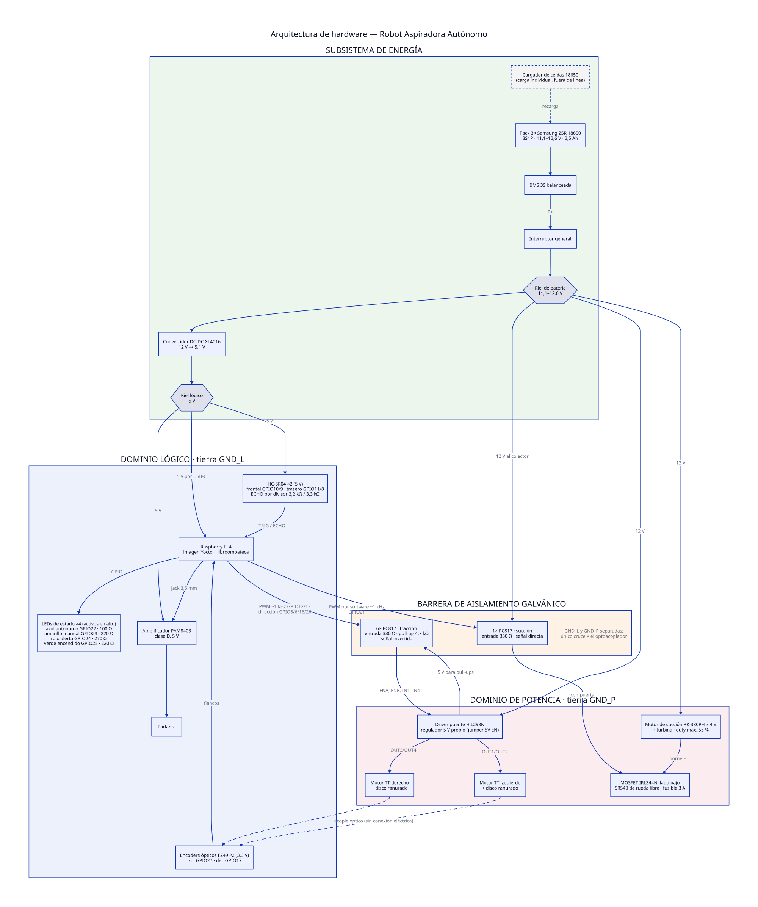
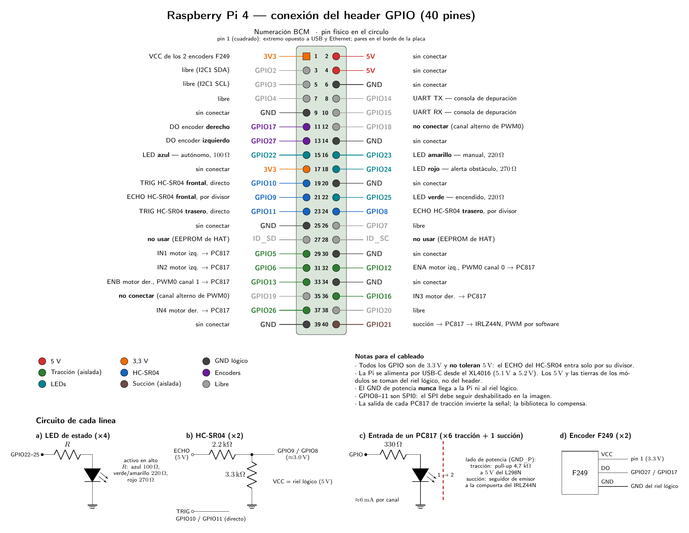
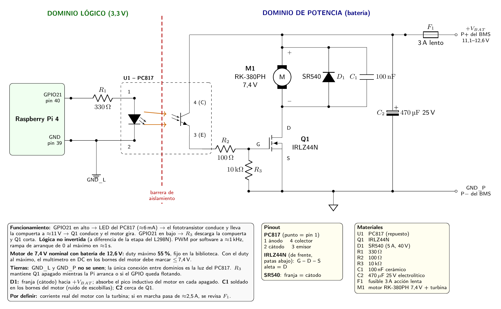

# 🤖 Roomba-Disco (Raspberry Pi 4)

Este repositorio contiene la infraestructura de **Linux Embebido**, la cadena de compilación cruzada (**SDK/Toolchain**) y el software de abstracción de hardware desarrollados para el robot aspiradora **Roomba-Disco**. El proyecto se basa en la distribución **Poky (Release 5.0 Scarthgap)** del **Proyecto Yocto** para la arquitectura **Raspberry Pi 4**.

---

## 💻 1. Diagramas de Arquitectura del Sistema

### 🏛️ Arquitectura de Software (Capas del Sistema)
El sistema está estructurado bajo un modelo en 4 niveles:

```text
+-----------------------------------------------------------------------+

|  CAPA 1: CLIENTE WEB / FRONTEND (Interfaz de Usuario)                 |
|  - Panel de control, Joystick virtual, Monitoreo de sensores 2D.     |
+-----------------------------------------------------------------------+
                                   │  (WebSockets / HTTP)
                                   ▼
+-----------------------------------------------------------------------+

|  CAPA 2: SERVIDOR WEB & LÓGICA (Backend en Node.js / Python / C++)    |
|  - Endpoints de control, algoritmo reactivo de evasión y mapeo.       |
+-----------------------------------------------------------------------+
                                   │  (Enlace Dinámico en C)
                                   ▼
+-----------------------------------------------------------------------+

|  CAPA 3: BIBLIOTECA DE ABSTRACCIÓN DE HARDWARE (libroombateca.so)     |
|  - Funciones nativas de control y hilos concurrentes de audio (POSIX).|
+-----------------------------------------------------------------------+
                                   │  (Llamadas al Sistema /sysfs)
                                   ▼
+-----------------------------------------------------------------------+

|  CAPA 4: INFRAESTRUCTURA / KERNEL LINUX EMBEBIDO (Yocto RootFS)       |
|  - Controladores PWM, ALSA Core, mpg123, Demon Systemd.            |
+-----------------------------------------------------------------------+
```

### 📟 Arquitectura de Hardware



El sistema se divide en cuatro dominios:

- **Subsistema de energía.** Pack de 3 celdas Samsung 25R 18650 en 3S1P (11,1–12,6 V,
  2,5 Ah) con BMS 3S balanceada e interruptor general en la salida. De ahí salen dos
  rieles regulados por separado: el riel de batería alimenta la etapa de potencia y un
  convertidor DC-DC XL4016 deriva el riel lógico de 5 V, que llega a la Pi por USB-C. Las
  celdas se cargan de forma individual, fuera de línea.
- **Dominio lógico** (tierra `GND_L`). Raspberry Pi 4 con imagen mínima construida con
  Yocto; expone el acceso a hardware mediante la biblioteca de control. Cuelgan de ella
  los dos sensores ultrasónicos HC-SR04 (frontal y trasero), los 4 LEDs de estado, los dos
  encoders ópticos F249 de la odometría y la salida de audio: jack de 3,5 mm →
  amplificador PAM8403 → parlante.
- **Barrera de aislamiento galvánico.** Optoacopladores PC817 en las 6 líneas de control
  del driver (`IN1`–`IN4`, `ENA`, `ENB`). Las tierras `GND_L` y `GND_P` se mantienen
  separadas y su único punto de cruce es el optoacoplador. Los pull-ups de salida se
  alimentan con el regulador de 5 V propio del L298N, nunca con el riel lógico.
- **Dominio de potencia** (tierra `GND_P`). Driver de puente H (L298N) con control de
  velocidad por PWM en `ENA`/`ENB`, y los dos motores TT de la tracción diferencial, cada
  uno con un disco ranurado que leen los encoders sin contacto eléctrico.

#### Mapa de pines GPIO (Raspberry Pi 4)



El PWM de los motores usa `GPIO12`/`GPIO13` (los dos canales de PWM0, función ALT0).
`GPIO18`/`GPIO19` son los mismos dos canales en pines alternativos, así que quedan sin
conectar. Las señales se agrupan por mazo: motores en los pines 29–37 y sensores y LEDs
en los pines 11–24.

| Función | Pin BCM | Pin físico | Dirección | Periférico | Nota |
|---|---|---|---|---|---|
| ENA (vel. motor izq.) | GPIO12 | 32 | out | PWM0 (hw) | por optoacoplador |
| ENB (vel. motor der.) | GPIO13 | 33 | out | PWM0 (hw) | por optoacoplador |
| IN1 (dir. motor izq. A) | GPIO5 | 29 | out | GPIO | por optoacoplador |
| IN2 (dir. motor izq. B) | GPIO6 | 31 | out | GPIO | por optoacoplador |
| IN3 (dir. motor der. A) | GPIO16 | 36 | out | GPIO | por optoacoplador |
| IN4 (dir. motor der. B) | GPIO26 | 37 | out | GPIO | por optoacoplador |
| LED autónomo (azul) | GPIO22 | 15 | out | GPIO | directo, 100 Ω serie, activo en alto |
| LED manual (amarillo) | GPIO23 | 16 | out | GPIO | directo, 220 Ω serie, activo en alto |
| LED alerta obstáculo (rojo) | GPIO24 | 18 | out | GPIO | directo, 270 Ω serie, activo en alto |
| LED encendido (verde) | GPIO25 | 22 | out | GPIO | directo, 220 Ω serie, activo en alto |
| TRIG HC-SR04 frontal | GPIO10 | 19 | out | GPIO | directo (3,3 V basta para disparar) |
| ECHO HC-SR04 frontal | GPIO9 | 21 | in | GPIO | por divisor 2,2 kΩ / 3,3 kΩ (5 V → ~3 V) |
| TRIG HC-SR04 trasero | GPIO11 | 23 | out | GPIO | directo |
| ECHO HC-SR04 trasero | GPIO8 | 24 | in | GPIO | por divisor 2,2 kΩ / 3,3 kΩ |
| Encoder izquierdo | GPIO27 | 13 | in | GPIO | directo (F249 a 3,3 V) |
| Encoder derecho | GPIO17 | 11 | in | GPIO | directo (F249 a 3,3 V) |
| Succión (compuerta del IRLZ44N) | GPIO21 | 40 | out | PWM por software, ~1 kHz | por optoacoplador, señal directa |
| Audio | — | — | — | jack | el jack analógico no usa pines del header |

Los sensores ocupan `GPIO8`–`GPIO11`, que son los pines de SPI0, así que el SPI debe
quedar deshabilitado en la imagen. `GPIO2`/`GPIO3` (I2C) y `GPIO14`/`GPIO15` (UART, consola
de depuración) quedan libres, igual que `GPIO4`, `GPIO7` y `GPIO20`.

En la tracción, la salida del optoacoplador es open-collector e invierte la señal recibida;
la compensación se hace en la biblioteca de control, no en la asignación de pines. En la
succión el PC817 trabaja como seguidor de emisor hacia la compuerta del MOSFET, así que la
señal llega sin invertir.



La succión no tiene canal de PWM por hardware libre (PWM0 lo usa el L298N y PWM1 el jack
de audio), así que `libroombateca` genera el PWM por software en un hilo. El motor es de
7,4 V y el riel de batería llega a 12,6 V: la potencia 100 de `succion_set()` equivale a un
duty del 55 %, con rampa de arranque de 1 s.

---

## 🛠️ 2. Instrucciones de Generación de la Imagen Yocto

**Aviso**: En los ejemplos de código habrán direcciones que tienen dirección parecida a `home/irmunoz/Taller4/`, ajustar a su usuario o directorio donde van a trabajarlo.

La guía completa para generar y flashear la imagen en una PC nueva, con las versiones de las capas fijadas, está en [`GENERAR_IMAGEN.md`](GENERAR_IMAGEN.md).

### Requisitos del Host (Anfitrión)
* **SO Recomendado:** Ubuntu 22.04 LTS o 24.04 LTS.
* **Espacio Libre:** Mínimo 90 GB en disco duro.
* **Paquetes Esenciales:** `gawk`, `wget`, `git`, `diffstat`, `unzip`, `texinfo`, `gcc`, `build-essential`, `chrpath`, `socat`, `cpio`, `xz-utils`, `zstd`, `liblz4-tool`, `file`.

### Paso 1: Clonar el Entorno Base y la Capa BSP
```bash
# Clonar Poky (Distribución base de Yocto - Versión Scarthgap)
git clone --branch yocto-5.0.15 https://git.yoctoproject.org/poky poky-scarthgap-5.0.15
cd poky-scarthgap-5.0.15

# Clonar el BSP Oficial de Raspberry Pi
git clone --branch scarthgap https://git.yoctoproject.org/meta-raspberrypi
```
Si hubo algún problema a la hora de descargar el kernel de Raspberry Pi, se puede descargar y continuar luego localmente guardando en un directorio creado para descargas

```bash
mkdir downloads
```

 y colocas el archivo descargado desde: `https://github.com/raspberrypi/linux/archive/refs/heads/rpi-6.6.y.tar.gz` y lo descomprimes en una carpeta que vamos a llamar `k-robot`y movemos la subcarpeta.

```bash
mkdir -p ~/k-robot
tar -xf linux-rpi-6.6.y.tar.gz -C ~/k-robot --strip-components=1
mv linux-rpi-6.6.y/* . 2>/dev/null || mv linux-rpi-*/* . 2>/dev/null
```

### Paso 2: Creación e Integración de layer personalizada `meta-robot`
Para alojar nuestras recetas, configuraciones multimedia y parches offline, se inicializa el entorno y se genera la capa del proyecto:
```bash
# Inicializar variables de entorno de BitBake
source oe-init-build-env rpi4

# Crear la capa meta-robot
bitbake-layers create-layer ../meta-robot

# Registrar y habilitar formalmente la capa en el entorno actual
bitbake-layers add-layer ../meta-robot
```

### Paso 3: Agregar el parche para búsqueda del BSP offline

En el directorio de construcción activa: `~/Taller4/poky-scarthgap-5.0.15/rpi4` creamos el parche:
```bash
nano ../meta-robot/recipes-kernel/linux/linux-raspberrypi_6.6.bbappend
```
Agregamos estas líneas al archivo usando la dirección de la carpeta k-robot:
```bash
inherit externalsrc
EXTERNALSRC = "/home/irmunoz/k-robot"

# Forzar el bypass definitivo de parches y chequeos de internet
KERNEL_DANGLING_FEATURES_WARN_ONLY = "1"
KERNEL_VERSION_SANITY_SKIP = "1"
```

### Paso 4: Configuración del Sistema (`conf/local.conf`)


Edite el archivo `conf/local.conf` para definir la máquina objetivo, habilitar la compilación offline (mitigación del error de red 128) y activar los módulos de hardware requeridos (Audio y PWM):
```bash
nano conf/local.conf
```
Agregar al final del archivo local.conf para el sistema:
```text
# [ESPECIFICA EL HARDWARE OBJETIVO]
MACHINE ?= "raspberrypi4-64"
CONF_VERSION = "2"

# [OPTIMIZACIÓN DE RECURSOS DEL HOST]
# Limita la ejecución a 5 hilos de procesamiento en paralelo para la estabilidad de la VM
BB_NUMBER_THREADS = "5"
PARALLEL_MAKE = "-j 5"
INHERIT += "rm_work"
SANITY_TESTED_DISTROS:append = " Ubuntu-24.04"

# [GESTIÓN DE ALMACENAMIENTO Y DESCARGAS OFFLINE]
DL_DIR ?= "/home/irmunoz/Taller4/poky-scarthgap-5.0.15/downloads"
PREMIRRORS:prepend = "git://./. https://yoctoproject.org \n"
BB_FETCH_PREFERENCE = "https http git"
BB_GIT_SHALLOW = "1"
BB_NO_NETWORK = "0"
BB_GENERATE_MIRROR_TARBALLS = "1"

# [MITIGACIÓN DE DESARROLLO LOCAL] Parche de bypass para desarrollo local offline del Kernel y biblioteca
INHERIT += "externalsrc"
KERNEL_VERSION_SANITY_SKIP = "1"

# [POLÍTICA DE LICENCIAS] Permite compilar componentes con restricciones de patentes y firmware propietario
LICENSE_FLAGS_ACCEPTED:append = " synaptics-killswitch"
LICENSE_FLAGS_ACCEPTED:append = " commercial"

# [AUDIO Y MULTIMEDIA] Instala ALSA + mpg123
IMAGE_INSTALL:append = " alsa-lib alsa-utils mpg123"

# [MOTORES] Invoca el Device Tree Overlay para activar 2 canales PWM nativos por hardware
RPI_EXTRA_CONFIG = "dtoverlay=pwm-2chan"

```

### Paso 5: Compilación de la Imagen Completa
Se envía a construir la imagen solo de la rasp y luego si sale bien se manda a construir la imagen extendida del sistema operativo del robot:
```bash
bitbake linux-raspberrypi
bitbake rpi-test-image
```

---

## 👨‍🍳 3. Estructura de la Receta Propia (`libroombateca_1.0.bb`)

Receta modular en CMake; toma las fuentes de `Biblioteca/` mediante `FILESEXTRAPATHS`. Extracto (el archivo completo está en la capa).

**Ubicación del archivo en la capa:** `Yocto/meta-robot/recipes-apps/libroombateca/libroombateca_1.0.bb`

```text
SUMMARY = "Biblioteca GPIO"
DESCRIPTION = "Metadatos en CMake cross-compile el control de perifericos e hilos de audio"
LICENSE = "MIT"
LIC_FILES_CHKSUM = "file://${COMMON_LICENSE_DIR}/MIT;md5=0835ade698e0bcf8506ecda2f7b4f302"

inherit cmake

# gpio_control.c enlaza contra libgpiod (API v2, char device)
DEPENDS += "libgpiod"

# El código de Biblioteca/ vive fuera de esta capa, en el mismo repo
FILESEXTRAPATHS:prepend := "${THISDIR}/../../../../Biblioteca:"

SRC_URI = "file://CMakeLists.txt \
           file://include \
           file://lib \
           file://audio \
"

S = "${WORKDIR}"

# audio_th.c reproduce los mp3 invocando mpg123
RDEPENDS:${PN} = "mpg123"

FILES:${PN} = "${libdir}/lib*.so"
FILES:${PN} += "${includedir}/*.h"
FILES:${PN} += "${datadir}/roomba-disco/audio/*.mp3"
```

---

## 💻 4. Instalación y Compilación con la Toolchain (SDK)

### Instalación del SDK Cruzado
El SDK generado por Yocto se encuentra instalado en la ruta fija del Host:
`/opt/poky/5.0.20/` (ruta por defecto del instalador; puede cambiarse con `-d`).

### Carga del Entorno de Compilación
Cada vez que se abra una terminal nueva para compilar código de forma manual o local, se debe ejecutar el script para inicializar variables:
```bash
source /opt/poky/5.0.20/environment-setup-cortexa72-poky-linux
```

### Validación Corta del Entorno
* **Verificación de Variable `$CC`:** 
  ```text
  bash: echo $CC
  ```
Al ejecutar `echo $CC` se demuestra que el compilador apunta al toolchain cruzado de ARM, este se describe en su salida: `aarch64-poky-linux-gcc -mcpu=cortex-a72+crc -mbranch-protection=standard -fstack-protector-strong -O2 -D_FORTIFY_SOURCE=2 -Wformat -Wformat-security -Werror=format-security --sysroot=/opt/poky/5.0.20/sysroots/cortexa72-poky-linux`

* **Compilación Manual de Prueba:**
  ```bash
  $CC helloworld.c -o test_arm
  ```
* **Prueba de Incompatibilidad en Host (Error Controlado):** Al intentar correr el binario en Ubuntu (`./test_arm`), el procesador x86_64 no lo entiende, ya que no está compilado para él:
  ```text
  bash: ./test_arm: cannot execute binary file: Exec format error
  ```
* **Emulación con QEMU:** Para probar el binario localmente sin la placa física:
  ```bash
  sudo apt-get install qemu-user
  qemu-aarch64 -L $SDKTARGETSYSROOT ./test_arm

  # Salida: ~~~¡Genial! Prueba sencilla de Roomba-disco desde la Raspberry Pi 4~~~
  ```

---

## 📦 5. Evidencias de Cross-Compile 

### Fragmento de Log Exitoso de Yocto (BitBake Reruns Cached)
Al agregar las dependencias multimedia y de PWM, BitBake demuestra el correcto uso del caché (*sstate*) y la compilación exitosa de las más de 6,167 tareas concurrentes de la imagen:

```text
irmunoz@EmbebYoctoUbuntu24-04:~/Taller4/poky-scarthgap-5.0.15/rpi4$ bitbake rpi-test-image
Loading cache: 100% |######################################################| Time: 0:00:51
Parsing of 962 .bb files complete (0 cached, 962 parsed). 1924 targets, 71 skipped, 0 masked, 0 errors.
NOTE: Resolving any missing task queue dependencies
Build Configuration:
BB_VERSION           = "2.8.1"
BUILD_SYS            = "x86_64-linux"
TARGET_SYS           = "arm-poky-linux-gnueabi"
MACHINE              = "raspberrypi4"
DISTRO               = "poky"
DISTRO_VERSION       = "5.0.20"
TUNE_FEATURES        = "arm vfp cortexa7 neon vfpv4 thumb callconvention-hard"
meta-robot           = "HEAD:69ae79bf5a01a24491648e2fdea6faf51aeb3bf2"

Sstate summary: Wanted 314 Local 179 Mirrors 0 Missed 135 Current 2567 (57% match, 95% complete)
NOTE: Executing Tasks
NOTE: Tasks Summary: Attempted 6167 tasks of which 5892 didn't need to be rerun and all succeeded.
Summary: There were 2 WARNING messages.
```

### Ejecución en Raspberry Pi 4 / Evidencias de Validación
`[PENDIENTE - Capturas y logs de comandos ejecutados en la terminal serial de la Raspberry Pi 4 real al arrancar por primera vez]`

---

## 📖 6. Documentación de la API de la Biblioteca Dinámica
`[PENDIENTE - Documentar la API de roombateca.h: roombateca_init/cleanup y los módulos de motores, sensores, encoders, LEDs y audio (parámetros, unidades, códigos de retorno y concurrencia)]`

---

## 📊 7. Reporte de Métricas de Eficiencia de Recursos
`[PENDIENTE - Mediciones operativas reales de la Raspberry Pi 4 física utilizando las herramientas necesarias dentro del mínimo establecido en el enunciado]:`
* **Tamaño de RootFS (Menor a 200 MB):** A medir con la herramienta `du -sh /`.
* **Tiempo de Arranque (Menor a 15s):** A medir con la herramienta `systemd-analyze`.
* **Consumo de RAM/CPU bajo carga operativa:** A medir con las utilidades de monitoreo de procesos `top` o `htop`.

---

## 📋 8. Resultados más relevantes del Proyecto y Conclusiones

`[PENDIENTE - Agregar más adelante]`

---

## 🎧 9. Probar el entorno en una compu nueva

### Inicializar las cosas en la Compu para probar

**Instalar el SDK de 64 bits en la compu**

Abre una terminal, ir donde se descargó el instalador .sh y ejecutar con permisos de administrador:

```bash
chmod +x poky-glibc-x86_64-core-image-minimal-cortexa72-raspberrypi4-64-toolchain-5.0.20.sh
sudo ./poky-glibc-x86_64-core-image-minimal-cortexa72-raspberrypi4-64-toolchain-5.0.20.sh
```

Cuando pregunte la ruta de instalación, darle Enter para aceptar la ruta por default (`/opt/poky/5.0.20/`).

**Flashear el linux nuestro en la Rasp**

- Poner la MicroSD en la PC.
- Abrir programita de Raspberry Pi Imager.
- Seleccionar el archivo comprimido `.wic.bz2` que está dentro del zip del drive (sacarlo del .zip antes), seleccionar la SD y presionar Flash.
- Sacar la tarjeta, poner en la Rasp y conectar un cable de red hacia el router o configurar el Wi-Fi.

**Conexión SSH**

Cambiar `<IP_RASPBERRY>` por la IP asignada a la Rasp y conectarse:

```bash
ssh root@<IP_RASPBERRY>
```

Con eso debería poder entrar como admin a root sin contraseña.

**Probar el .c de sonido con hilos de ejemplo**

Cargar el entorno de cross-compile (64 bits):

```bash
source /opt/poky/5.0.20/environment-setup-cortexa72-poky-linux
```

Compilar el binario para la rasp:

```bash
$CC main_test.c -I./include -L. -lroombateca -lpthread -o el_test
```

Transferir el ejecutable y la biblioteca por red a la Rasp:

```bash
scp el_test libroombateca.so root@<IP_RASPBERRY>:/usr/lib/
```

En la terminal SSH de la Rasp, conectar audífonos o parlantes al Jack y correr el binario:

```bash
export LD_LIBRARY_PATH=/usr/lib
el_test
```

Para generar el SDK desde cero y para iterar sobre la Pi corriendo con `devtool` (sin
reflashear), ver [`Yocto/README.md`](Yocto/README.md).
